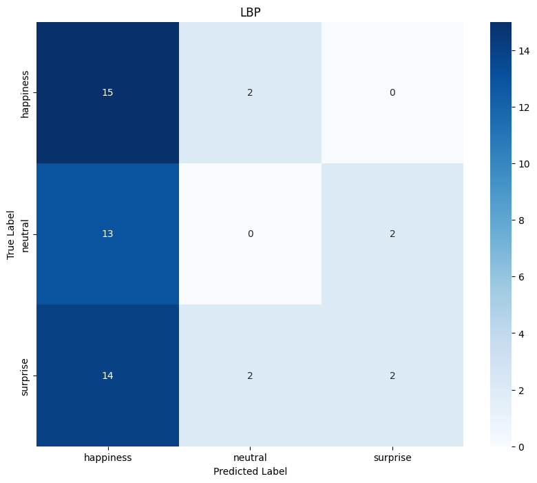
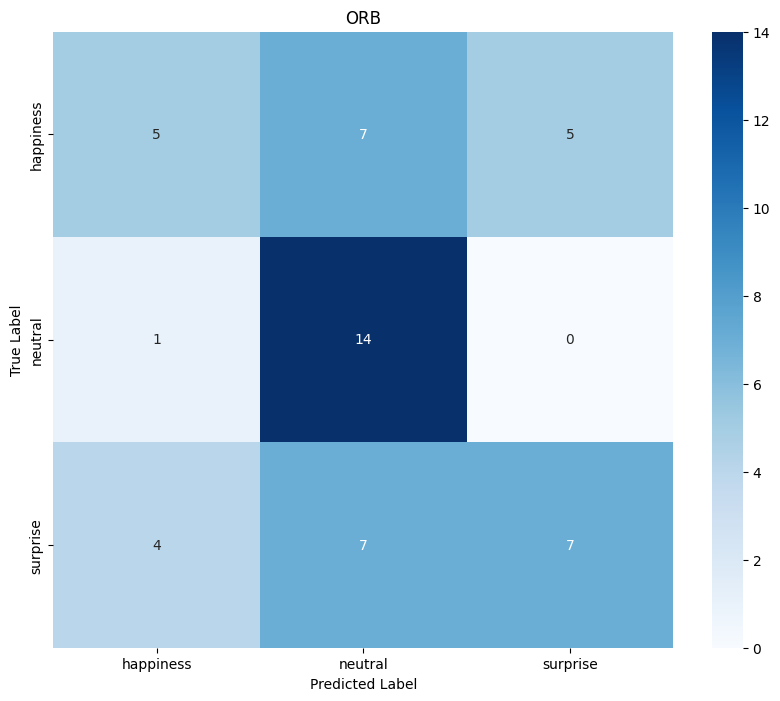
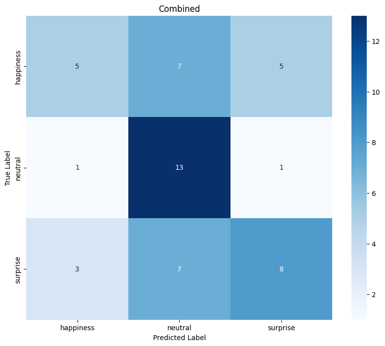
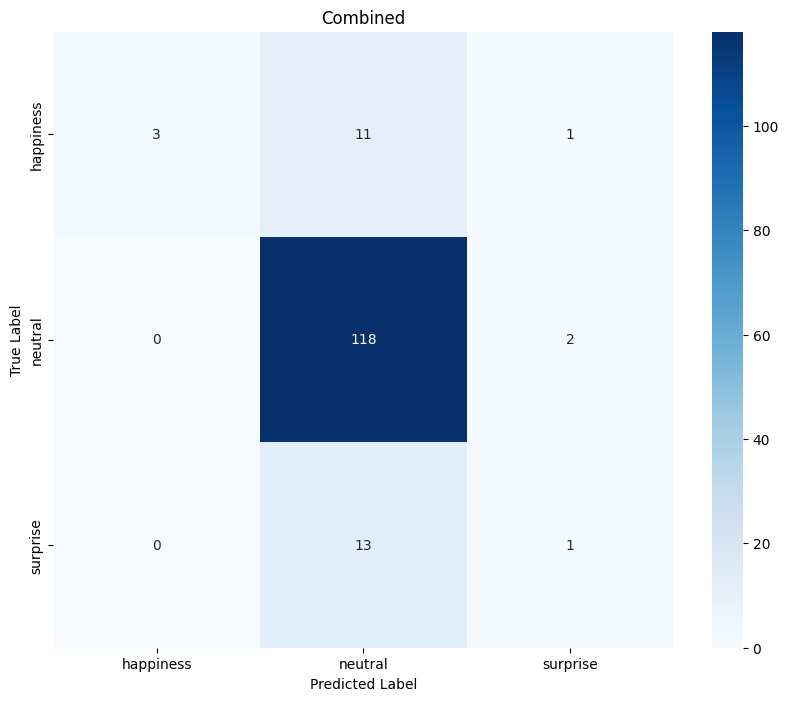
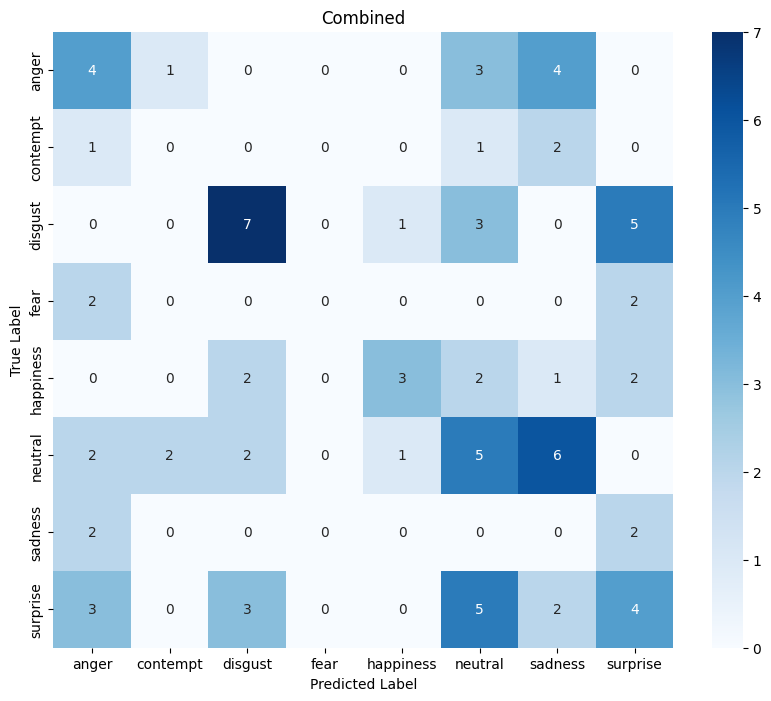

# Facial Expression Recognition Project

## Overview
This project is based on the paper *"Facial Expression Recognition with LBP and ORB Features"* by Ben Niu, Zhenxing Gao, and Bingbing Guo. It trains an SVM classifier to recognize facial expressions from still images using two classic (non-deep-learning) texture/keypoint descriptors — **LBP** (Local Binary Patterns) and **ORB** (Oriented FAST and Rotated BRIEF) — evaluated individually and as a fused feature set, on the [CK+ dataset](https://www.jeffcohn.net/Resources/).

There are two entry points:
- `classification.py` — trains and evaluates LBP, ORB, and Combined SVM models on the CK+ dataset.
- `main.py` — loads one of those trained models and predicts the expression in a single new image.

## Pipeline
Both training and inference share the same feature pipeline, implemented in `utils.py`:

1. **Face detection** — each image is converted to grayscale and run through OpenCV's Haar Cascade frontal-face detector (`haarcascade_frontalface_default.xml`). If multiple faces are detected, the largest bounding box is used; if none are detected, the image is skipped (training) or an error is raised (inference).
2. **LBP feature extraction** (`extractLbpFeatures`) — computes a uniform Local Binary Pattern (radius=1, 8 points) over the cropped face and returns a normalized 10-bin histogram, capturing local texture.
3. **ORB feature extraction** (`extractOrbFeatures`) — detects up to 500 ORB keypoints (32-byte descriptors each), flattens them, and zero-pads to a fixed-length 16,000-dim vector, capturing local keypoint structure. Zero-padding keeps every image's ORB vector the same length regardless of how many keypoints were actually found.
4. **Feature fusion** (`featureFusion` / `zScoreNormalization`) — LBP and ORB vectors are each Z-score normalized (scaled by `K=100`, with a small constant `C=1` added to the denominator to avoid divide-by-zero), then concatenated into a single "Combined" feature vector. This roughly equalizes the two descriptors' scales before combining them, as described in the source paper.
5. **Class balancing (optional, on by default)** — training data is rebalanced with an `imblearn` pipeline: `SMOTE` oversamples minority emotion classes up to the size of the largest class, then `RandomUnderSampler` trims all classes down to the size of the smallest class, before the SVM sees any data. This exists because CK+ is heavily skewed toward the "neutral" class. Pass `--unbalance` to skip this and train on the raw class distribution instead (with `class_weight='balanced'` still applied to the SVM).
6. **Classification** — a linear-kernel `SVC` (`class_weight='balanced'`, `random_state=42`) is trained separately for the LBP, ORB, and Combined feature sets, on an 80/20 train/test split (`random_state=42` for reproducibility).
7. **Evaluation** — for each feature set: a `classification_report`, a confusion matrix (plotted as a seaborn heatmap), and per-class accuracy are printed/displayed.
8. **Inference** (`main.py`) — given an image and a saved model, the same face-detection and feature-extraction steps are applied (using whichever feature type the model was trained on), then the model's `predict` and `decision_function` are used to display the image with its predicted emotion and the top-4 candidate emotions by decision score.

## Codebase Structure

| File | Purpose |
|---|---|
| `utils.py` | Shared feature-extraction and evaluation helpers: `extractLbpFeatures`, `extractOrbFeatures`, `selectLargestFace`, `processEmotionImages` (walks the dataset folder and extracts features/labels for every image), `zScoreNormalization`, `featureFusion`, `displayResults` (prints metrics, plots confusion matrix). |
| `classification.py` | Training CLI. Loads the dataset via `processEmotionImages`, builds the Combined feature set via `featureFusion`, then trains/evaluates an SVM per feature set (`trainAndEvaluate`), optionally saving each model to disk. |
| `main.py` | Inference CLI. Loads a saved model (and the feature type it was trained on), runs the pipeline on a single image, and displays the predicted emotion with decision scores. |
| `requirements.txt` | Python dependencies. |
| `scripts/prepare_dataset.py` | Rebuilds `datasets/CK+/<emotion>/*.jpg` from a `ckextended.csv`-style export (see [Dataset](#dataset)). |
| `datasets/CK+/` | Expected dataset location (not included in this repo — see [Dataset](#dataset)). |

## Dataset
Training expects images laid out at `datasets/CK+/`, with one subfolder per emotion:

```
datasets/CK+/
├── anger/
├── contempt/
├── disgust/
├── fear/
├── happiness/
├── neutral/
├── sadness/
└── surprise/
```

The `datasets/` folder is gitignored and not included in this repository. By default, `classification.py` trains on only the `happiness` / `neutral` / `surprise` subset (`--all_emotions` uses all eight above); regardless, at most 100 images per emotion are sampled per run unless `--unbalance` is passed.

This project's dataset is a CSV export of CK+ (`emotion,pixels,Usage` columns, 48×48 grayscale pixels per row, 920 rows total) rather than the raw CK+ image release. If you have a `ckextended.csv`-style file, rebuild the folder layout above with:

```
python scripts/prepare_dataset.py path/to/ckextended.csv
```

The class distribution in that export is heavily skewed toward "neutral", which is exactly the imbalance the SMOTE/undersampling step (see [Pipeline](#pipeline), step 5) exists to correct:

| Emotion | Images |
|---|---|
| Neutral | 593 |
| Surprise | 83 |
| Happiness | 69 |
| Disgust | 59 |
| Anger | 45 |
| Sadness | 28 |
| Fear | 25 |
| Contempt | 18 |

## Installation and Execution
1. Install dependencies: `pip install -r requirements.txt`.

   Note: `opencv-python` is pinned to `<5` — OpenCV 5.0 removed `cv2.CascadeClassifier` and the bundled Haar cascade XML files that this project's face detection depends on, so a plain `pip install opencv-python` on a recent version will fail at runtime.
2. To train the model with various parameters (sampling techniques and datasets), use `python classification.py`. Include flags as needed:
   - `--save_model`: To save each trained model.
   - `--unbalance`: To run without any sampling techniques (SMOTE/undersampling).
   - `--all_emotions`: To train on all eight emotions instead of the default three.
   - `--save_figures`: To save each confusion matrix as a PNG under `figures/{complete|reduced}_{balanced|unbalanced}/`.

   Saved models are written to `{complete|reduced}_{balanced|unbalanced}_{LBP|ORB|Combined}_model.pkl` in the working directory, e.g. `reduced_balanced_Combined_model.pkl`.
3. To predict emotions in a specific image using a trained model, run: `python main.py [PathToImage] [PathToModel]`.

## Results
Results below are from actual runs of `classification.py` against the dataset described above (`python classification.py --save_model --save_figures`, with `--all_emotions`/`--unbalance` as noted). Given how small some classes are (as few as 18 images for "contempt"), and that the images are already-cropped 48×48 snippets, treat these as a demonstration of the pipeline rather than a benchmark of LBP/ORB/SVM's ceiling on CK+.

### Reduced (happiness / neutral / surprise), balanced — default settings
SMOTE oversampling + random undersampling applied before training, so the three classes are trained on equally.

| Feature Set | Overall Accuracy |
|---|---|
| LBP | 34.0% |
| ORB | 52.0% |
| Combined | 52.0% |





LBP alone collapses onto "happiness" (88% recall there, 0% recall on "neutral"); ORB and the Combined feature set both do meaningfully better and are close to each other, suggesting ORB's keypoint descriptors carry most of the useful signal on this subset while LBP's texture histogram contributes comparatively little.

### Reduced (happiness / neutral / surprise), unbalanced — `--unbalance`
Same three classes, but trained on the raw distribution (593 neutral vs. 69 happiness vs. 83 surprise), with only the SVM's `class_weight='balanced'` to compensate.

| Feature Set | Overall Accuracy |
|---|---|
| LBP | 8.7% |
| ORB | 81.9% |
| Combined | 81.9% |



The headline 81.9% accuracy for ORB/Combined is misleading on its own: per-class recall was 98% for "neutral" but only 20% for "happiness" and 7% for "surprise" — the model is mostly just predicting the majority class. This is the exact failure mode the SMOTE/undersampling step in the balanced runs above is meant to fix, and matches what the balanced numbers show: lower headline accuracy, but far more even recall across classes.

### Complete (all 8 emotions), balanced — `--all_emotions`

| Feature Set | Overall Accuracy |
|---|---|
| LBP | 15.3% |
| ORB | 23.5% |
| Combined | 27.1% |



Accuracy drops substantially with 8 classes instead of 3, which is expected — several classes ("contempt", "fear", "sadness") have only 18–28 total images before the 80/20 split, leaving as few as 4 test examples per class. Across all three runs above, Combined matches or beats ORB alone, and both consistently beat LBP alone — the clearest gap in Combined's favor is here, in the harder 8-class case.

## Known Limitations
- The dataset used to produce the results above is a small (920-image), already face-cropped 48×48 CSV export, not the full raw CK+ release — absolute accuracy numbers shouldn't be compared directly to results reported elsewhere on CK+.
- "Contempt", "fear", and "sadness" have too few images (18–28) for the 8-class run to be very meaningful; treat those per-class numbers as noisy.
- `opencv-python` must stay below version 5 (see [Installation and Execution](#installation-and-execution)).

## Reference
Niu, B., Gao, Z., & Guo, B. "Facial Expression Recognition with LBP and ORB Features."
